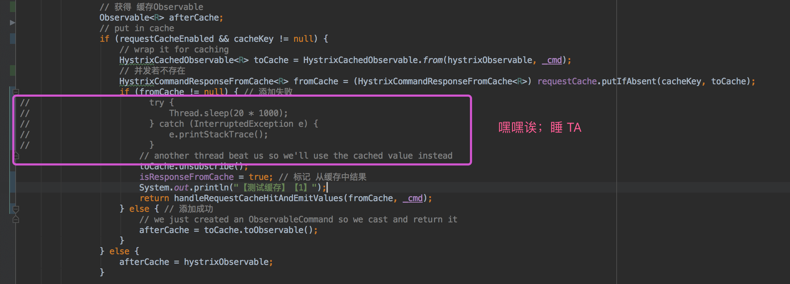

# 1. 概述

本文主要分享 **Hystrix 执行命令的结果缓存**。

建议 ：对 RxJava 已经有一定的了解的基础上阅读本文。

Hystrix 执行命令整体流程如下图：

> FROM [《【翻译】Hystrix文档-实现原理》「流程图」](http://youdang.github.io/2016/02/05/translate-hystrix-wiki-how-it-works/#流程图)  
> [](../../../images/Hystrix/2018_10_15/01.jpeg)

* 红圈 ：在 [《Hystrix 源码解析 —— 执行命令方式》](http://www.iocoder.cn/Hystrix/command-execute-mode/?self) 有详细解析。
* 紫圈 ：在 `#toObservable()` 方法里，如果请求结果缓存这个特性被**启用**，并且**缓存命中**，则缓存的回应会立即通过一个 Observable 对象的形式返回；如果**缓存未命中**，则返回【**订阅了执行命令的 Observable**】的 ReplySubject 对象缓存执行结果。
    * ReplySubject 能够**重放**执行结果，从而实现缓存的功效。本文不对 ReplySubject 做太多拓展，感兴趣的同学可以阅读 [《ReactiveX/RxJava文档中文版 —— Subject》](https://mcxiaoke.gitbooks.io/rxdocs/content/Subject.html) 。

// TODO 单元测试

**推荐 Spring Cloud 书籍**：

* 请支持正版。下载盗版，**等于主动编写低级 BUG** 。
* 程序猿DD —— [《Spring Cloud微服务实战》](https://union-click.jd.com/jdc?d=505Twi)
* 周立 —— [《Spring Cloud与Docker微服务架构实战》](https://union-click.jd.com/jdc?d=k3sAaK)
* 两书齐买，京东包邮。

# 2. 好处

点击 [《【翻译】Hystrix文档-实现原理》「请求缓存」](http://youdang.github.io/2016/02/05/translate-hystrix-wiki-how-it-works/#请求缓存) ，查看对**请求缓存**的好处分享，写的真的很赞。

# 3. Observable#defer(...)

本小节为**拓展内容**，源码解析 RxJava ( 非 Hystrix ) 的 `Observable#defer(...)` 的方法实现。考虑到 Hystrix 大量使用，为了更好的理解，解析下源码。

在一些业务场景下，我们需要 Observable 是**动态**的，例如说，本文分享的缓存 Observable ，无法在创建 Observable 阶段就知道是否有缓存，通过 `Observable#defer(...)` 方法，声明**动态**的 Observable 。示例代码如下：

```Java
public static void main(String[] args) {
   Observable.defer(new Func0<Observable<String>>() { // #defer(...)
       @Override
       public Observable<String> call() {
           String name = Math.random() > 0.5 ? "小明" : "小贾"; // 随机名字
           return Observable.just(name);
       }
   }).subscribe(new Action1<String>() { // #subscribe(...)
       @Override
       public void call(String s) {
           System.out.println(s);
       }
   });
}
```

-------

`Observable#defer(...)` 方法，代码如下：

```Java
// Observable.java
public static <T> Observable<T> defer(Func0<Observable<T>> observableFactory) {
   return create(new OnSubscribeDefer<T>(observableFactory));
}

public static <T> Observable<T> create(OnSubscribe<T> f) {
   return new Observable<T>(RxJavaHooks.onCreate(f));
}
```

* 使用传入 `observableFactory` 参数，生成**动态**的 Observable 。  

-------

OnSubscribeDefer 类，代码如下：

```Java
public final class OnSubscribeDefer<T> implements OnSubscribe<T> {
    final Func0<? extends Observable<? extends T>> observableFactory;

    public OnSubscribeDefer(Func0<? extends Observable<? extends T>> observableFactory) {
        this.observableFactory = observableFactory;
    }

    @Override
    public void call(final Subscriber<? super T> s) {
        Observable<? extends T> o;
        try {
            o = observableFactory.call();
        } catch (Throwable t) {
            Exceptions.throwOrReport(t, s);
            return;
        }
        o.unsafeSubscribe(Subscribers.wrap(s));
    }

}
```

* 在 `Observable#subscribe(...)` 方法调用时，调用 `OnSubscribeDefer#call(...)` 方法 ：
    * 调用 `Func0#call()` 方法，创建**动态**的 Observable 。
    * 调用 `Observable#unsafeSubscribe(...)` 方法，**继续订阅逻辑**。

# 4. AbstractCommand#toObservavle(...)

`AbstractCommand#toObservavle(...)` 方法，代码如下 ：

```Java
  1: public Observable<R> toObservable() {
  2:     final AbstractCommand<R> _cmd = this;
  3: 
  4:     //doOnCompleted handler already did all of the SUCCESS work
  5:     //doOnError handler already did all of the FAILURE/TIMEOUT/REJECTION/BAD_REQUEST work
  6:     final Action0 terminateCommandCleanup = new Action0() {} // ... 省略
  7: 
  8:     //mark the command as CANCELLED and store the latency (in addition to standard cleanup)
  9:     final Action0 unsubscribeCommandCleanup = new Action0() {} // ... 省略
 10: 
 11:     final Func0<Observable<R>> applyHystrixSemantics = new Func0<Observable<R>>() {
 12:         @Override
 13:         public Observable<R> call() {
 14:             if (commandState.get().equals(CommandState.UNSUBSCRIBED)) {
 15:                 return Observable.never();
 16:             }
 17:             return applyHystrixSemantics(_cmd);
 18:         }
 19:     };
 20: 
 21:     final Func1<R, R> wrapWithAllOnNextHooks = new Func1<R, R>() {} // ... 省略 
 22: 
 23:     final Action0 fireOnCompletedHook = new Action0() {} // ... 省略 
 24: 
 25:     return Observable.defer(new Func0<Observable<R>>() {
 26:         @Override
 27:         public Observable<R> call() {
 28:             /* this is a stateful object so can only be used once */
 29:             if (!commandState.compareAndSet(CommandState.NOT_STARTED, CommandState.OBSERVABLE_CHAIN_CREATED)) {
 30:                 IllegalStateException ex = new IllegalStateException("This instance can only be executed once. Please instantiate a new instance.");
 31:                 //TODO make a new error type for this
 32:                 throw new HystrixRuntimeException(FailureType.BAD_REQUEST_EXCEPTION, _cmd.getClass(), getLogMessagePrefix() + " command executed multiple times - this is not permitted.", ex, null);
 33:             }
 34: 
 35:             // 命令开始时间戳
 36:             commandStartTimestamp = System.currentTimeMillis();
 37: 
 38:             // TODO【2001】【打印日志】
 39:             if (properties.requestLogEnabled().get()) {
 40:                 // log this command execution regardless of what happened
 41:                 if (currentRequestLog != null) {
 42:                     currentRequestLog.addExecutedCommand(_cmd);
 43:                 }
 44:             }
 45: 
 46:             // 缓存开关、缓存KEY
 47:             final boolean requestCacheEnabled = isRequestCachingEnabled();
 48:             final String cacheKey = getCacheKey();
 49: 
 50:             // 优先从缓存中获取
 51:             /* try from cache first */
 52:             if (requestCacheEnabled) {
 53:                 HystrixCommandResponseFromCache<R> fromCache = (HystrixCommandResponseFromCache<R>) requestCache.get(cacheKey);
 54:                 if (fromCache != null) {
 55:                     isResponseFromCache = true; // 标记 从缓存中结果
 56:                     return handleRequestCacheHitAndEmitValues(fromCache, _cmd);
 57:                 }
 58:             }
 59: 
 60:             // 获得 执行命令Observable
 61:             Observable<R> hystrixObservable =
 62:                     Observable.defer(applyHystrixSemantics)
 63:                             .map(wrapWithAllOnNextHooks);
 64: 
 65:             // 获得 缓存Observable
 66:             Observable<R> afterCache;
 67:             // put in cache
 68:             if (requestCacheEnabled && cacheKey != null) {
 69:                 // wrap it for caching
 70:                 HystrixCachedObservable<R> toCache = HystrixCachedObservable.from(hystrixObservable, _cmd);
 71:                 // 并发若不存在
 72:                 HystrixCommandResponseFromCache<R> fromCache = (HystrixCommandResponseFromCache<R>) requestCache.putIfAbsent(cacheKey, toCache);
 73:                 if (fromCache != null) { // 添加失败
 74:                     // another thread beat us so we'll use the cached value instead
 75:                     toCache.unsubscribe();
 76:                     isResponseFromCache = true; // 标记 从缓存中结果
 77:                     return handleRequestCacheHitAndEmitValues(fromCache, _cmd);
 78:                 } else { // 添加成功
 79:                     // we just created an ObservableCommand so we cast and return it
 80:                     afterCache = toCache.toObservable();
 81:                 }
 82:             } else {
 83:                 afterCache = hystrixObservable;
 84:             }
 85: 
 86:             //
 87:             return afterCache
 88:                     .doOnTerminate(terminateCommandCleanup)     // perform cleanup once (either on normal terminal state (this line), or unsubscribe (next line))
 89:                     .doOnUnsubscribe(unsubscribeCommandCleanup) // perform cleanup once
 90:                     .doOnCompleted(fireOnCompletedHook);
 91:         }
 92:     });
 93: }
```

* 第 2 行 ：`_cmd` 指向当前命令对象，用于下面实现 FuncX ，ActionX 内部类使用。
* 第 11 至 19 行 ：当缓存特性**未开启**，或者缓存**未命中**时，使用 `applyHystrixSemantics` 传入 `Observable#defer(...)` 方法，声明**执行命令**的 Observable。
* 第 25 行 ：声明缓存 Observable 。Hystrix 执行命令的 Observable 声明关系如下：

    [](../../../images/Hystrix/2018_10_15/02.png)

* 第 29 至 33 行 ：**一条命令只能执行一次**。
* 第 36 行 ：记录命令**开始**时间戳。
* 第 38 至 44 行 ：TODO【2001】【打印日志】
* 第 47 至 48 行 ：缓存存开关、KEY 。
* 第 52 至 58 行 ：如果请求结果缓存这个特性被**启用**，并且**缓存命中**，则缓存的回应会立即通过一个 Observable 对象的形式返回。
    * 第 53 行 ：`requestCache` 缓存，在 [「5. 缓存」](#) 详细解析。
    * 第 53 行 ：HystrixCommandResponseFromCache ，在**第 70 行**详细解析。
    * 第 56 行 ：`#handleRequestCacheHitAndEmitValues(...)` 方法，在**第 78 行**详细解析。
* 第 61 至 63 行 ：获取**执行命令**的 Observable 。在 [TODO 【2004】【执行与fallbak】](#) 详细解析。
* 第 68 至 81 行 ：当缓存特性**开启**，并且缓存**未命中**时，创建【**订阅了执行命令的 Observable**】的 HystrixCommandResponseFromCache 。
    * 第 69 至 72 行 ：创建 HystrixCommandResponseFromCache ，并添加到 `requestCache` 。哟，`HystrixRequestCache#putIfAbsent(...)` 方法，**多个线程**添加时，只有一个线程添加成功。
    * 第 73 至 77 行 ：添加**失败**的线程( **们** )：
        * 第 75 行 ：调用 `HystrixCommandResponseFromCache#unsubscribe()` 方法，取消 HystrixCommandResponseFromCache 的订阅。这一步很关键，因为我们**不希望缓存不存在时，多个线程去执行命令，最好有且只有一个线程执行命令**。在 [「5. HystrixCachedObservable」](#) 详细解析。
        * 第 77 行 ：TODO
   * 第 80 行 ：调用 `HystrixCommandResponseFromCachetoObservable()` 方法，获得缓存 Observable 。
* 第 82 至 84 行 ：当缓存特性**未开启**，使用执行命令 Observable 。
* 第 87 至 91 行 ：在返回的 Observable 上，订阅一些清理的处理逻辑。对这几个方法有疑惑的同学，可以阅读 [《给 Android 开发者的 RxJava 详解》「 3) Subscribe (订阅) 」](http://gank.io/post/560e15be2dca930e00da1083#toc_10) 。

# 5. HystrixCachedObservable

`com.netflix.hystrix.HystrixCachedObservable` ，缓存 Observable 。

HystrixCachedObservable **构造方法**，代码如下 ：

```Java
  1: public class HystrixCachedObservable<R> {
  2: /**
  3:  * 订阅
  4:  */
  5: protected final Subscription originalSubscription;
  6: /**
  7:  * 缓存 cachedObservable
  8:  */
  9: protected final Observable<R> cachedObservable;
 10: /**
 11:  * TODO 【2006】【outstandingSubscriptions】
 12:  */
 13: private volatile int outstandingSubscriptions = 0;
 14: //private AtomicInteger outstandingSubscriptions2 = new AtomicInteger(0);
 15: 
 16: protected HystrixCachedObservable(final Observable<R> originalObservable) {
 17:     ReplaySubject<R> replaySubject = ReplaySubject.create();
 18:     this.originalSubscription = originalObservable
 19:             .subscribe(replaySubject);
 20: 
 21:     this.cachedObservable = replaySubject
 22:             .doOnUnsubscribe(new Action0() {
 23:                 @Override
 24:                 public void call() {
 25:                     outstandingSubscriptions--;
 26:                     if (outstandingSubscriptions == 0) {
 27:                         originalSubscription.unsubscribe();
 28:                     }
 29:                 }
 30:             })
 31:             .doOnSubscribe(new Action0() {
 32:                 @Override
 33:                 public void call() {
 34:                     outstandingSubscriptions++;
 35:                 }
 36:             });
 37: }
```

* 第 17 至 19 行 ：实际上，**HystrixCachedObservable 不是一个 Observable 的子类**，而是对传入的 Observable **封装** ：使用 ReplaySubject 向传入的 Observable 发起订阅，通过 ReplaySubject 能够**重放**执行结果，从而实现缓存的功效。这里有几个卡到笔者的并且很有趣的点，我们一一道来 ：从上文中，我们可以看到，传入的 `originalObservable` 为 `hystrixObservable` 执行命令 Observable 。在 Hystrix 里，提供了两种执行命令的隔离方式 ：线程池( `THREAD` ) 和信号量( `SEMAPHORE` )。
    * 当使用 `THREAD` 隔离时，`#subscribe(replaySubject)` 调用完成时，**实际命令并未开始执行**，或者说，这是一个**异步**的执行命令的过程。那么，**会不会影响返回执行结果呢**？答案当然是不会，BlockingObservable 在得到执行完成才会**结束阻塞**，此时已经有执行结果。
    * 当使用 `SEMAPHORE` 隔离时，`#subscribe(replaySubject)` 调用完成时，**实际命令已经执行完成**，所以即使 `AbstractCommand#toObservavle(...)` 的第 75 行 ：调用 `HystrixCommandResponseFromCache#unsubscribe()` 方法，也会浪费，**重复**执行命令。而对于 `THREAD` 隔离的情况，通过取消订阅的方式，只会执行**一次**命令。当然，如果“恶搞” `THREAD` 隔离的情况，增加 `sleep` 的调用如下，就能达到**重复**执行命令的效果。

        

* 第 21 至 36 行 ：TODO 【2006】【outstandingSubscriptions】原子性没问题么？历史版本使用的是 AtomicInteger 。

-------

HystrixCachedObservable 的其他方法，点击 [链接](https://github.com/Netflix/Hystrix/blob/1f64fced24289ea435f1e2d5a47a068bf7b79729/hystrix-core/src/main/java/com/netflix/hystrix/HystrixCachedObservable.java) 查看。
    
# 6. HystrixCommandResponseFromCache

`com.netflix.hystrix.HystrixCommandResponseFromCache` ，是 HystrixCachedObservable 的子类。在父类的基础上，增加了对 `AbstractCommand.executionResult` 的关注。

`HystrixCachedObservable#from(Observable, AbstractCommand)` 方法，创建 HystrixCommandResponseFromCache 对象，点击 [链接](https://github.com/Netflix/Hystrix/blob/1f64fced24289ea435f1e2d5a47a068bf7b79729/hystrix-core/src/main/java/com/netflix/hystrix/HystrixCachedObservable.java#L36) 查看。

-------

`HystrixCommandResponseFromCache#toObservableWithStateCopiedInto(...)` 方法，点击 [链接](https://github.com/Netflix/Hystrix/blob/1f64fced24289ea435f1e2d5a47a068bf7b79729/hystrix-core/src/main/java/com/netflix/hystrix/HystrixCommandResponseFromCache.java#L17) 查看。

* 通过 `completionLogicRun` 属性，保证 `#doOnError()` ，`#doOnCompleted()` ，`#doOnUnsubscribe()` 方法有且只有一个方法执行具体逻辑。
    * `#doOnError()` ，`#doOnCompleted()` 执行时，调用 `#commandCompleted()` 方法，从缓存命令( `HystrixCommandResponseFromCache.originalCommand` ) 复制 `executionResult` 属性给当前命令( `commandToCopyStateInto` ) 。
    * `#doOnUnsubscribe()` 执行时，调用 `#commandUnsubscribed()` 方法，使用当前命令( `commandToCopyStateInto` )**自己**的 `executionResult` ，不进行复制。
* TODO 【2007】【executionResult】用途

# 666. 彩蛋


